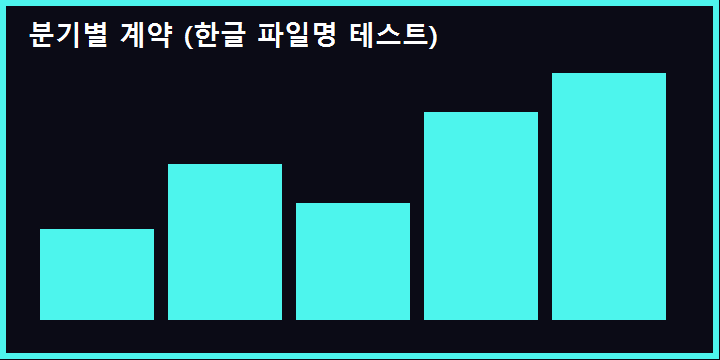
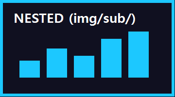

# 폴더 드롭 검증

이 **폴더를 통째로** mdrop.app 창에 끌어다 놓으세요. 파일이 아니라 폴더째로요.
그러면 이 README 가 자동으로 열리고, 아래 이미지들이 상대경로로 해석됩니다.

## 1. 한글 파일명

기대: 다크 배경에 민트색 막대 그래프가 보여야 합니다.

## 2. 영문 파일명

기대: 오렌지 테두리 이미지.

## 3. 중첩 폴더 (img/sub/)

기대: 하늘색 이미지. 하위 폴더 두 단계도 찾아 들어가는지 확인.

## 4. 일부러 없는 파일

기대: **점선 테두리 자리표시자**. 깨진 그림 아이콘이 아니라 점선 박스면 정상입니다.

## 5. 라이브 리로드 겸사겸사

이 파일을 VS Code 로 열어 아무 글자나 고치고 저장해 보세요.
화면이 1초 안에 다시 그려지고, 우상단 `LIVE` 뱃지가 켜져 있어야 합니다.

- [ ] 한글 파일명 이미지 표시됨
- [ ] 영문 파일명 이미지 표시됨
- [ ] 중첩 폴더 이미지 표시됨
- [ ] 없는 파일은 점선 자리표시자
- [ ] 저장하면 즉시 반영
